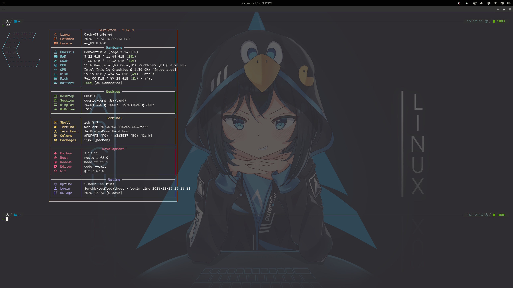

<div align="center">
  <br> 
    <i>My personal dotfiles for Arch and MacOS 🚀 </i>
 </div>
 <br>
 <br>


JershBytes's dotfiles, managed with [`chezmoi`](https://github.com/twpayne/chezmoi).

Install them with:

```console
pacman -S bitwarden-cli chezmoi git yay zsh
```

Then initialize chezmoi with:

```console
chezmoi init jershbytes
```

Personal secrets are stored in [Bitwarden](https://bitwarden.com/) and you'll
need the [Bitwarden CLI](https://bitwarden.com/help/cli/) installed.
Login to Bitwarden with:

```console
bw login
export BW_SESSION=$(bw unlock --raw)
```

<h1 align="center">
  Preview
</h1>


