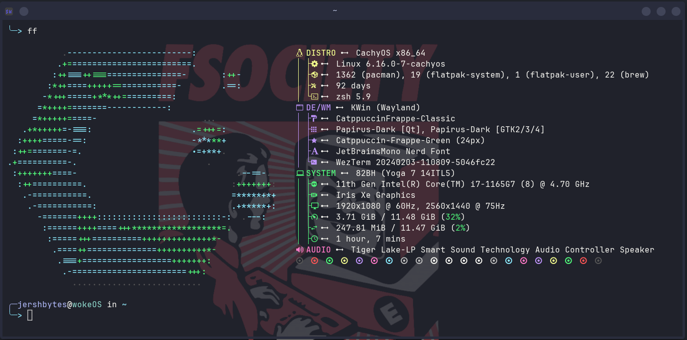

<div align="center">
  <br> 
    <i>My personal dotfiles for Linux and MacOS 🚀 </i>
 </div>
 <br>
 <br>


This repo contains the configurations to set up my machines. This is using [**Chezmoi**](https://www.chezmoi.io/), the dotfile manager to set up the installation.

This automated setup is currently only configured for `Arch and MacOS`.

## 🏃How to run

```shell
export GITHUB_USERNAME=JershBytes

pacman -S chezmoi

chezmo -- init --apply git@gitlab.com:$GITHUB_USERNAME/dotfiles
```
## ⚖️ LICENSE
can be found [here](/LICENSE)

## :camera: Screenshots 


